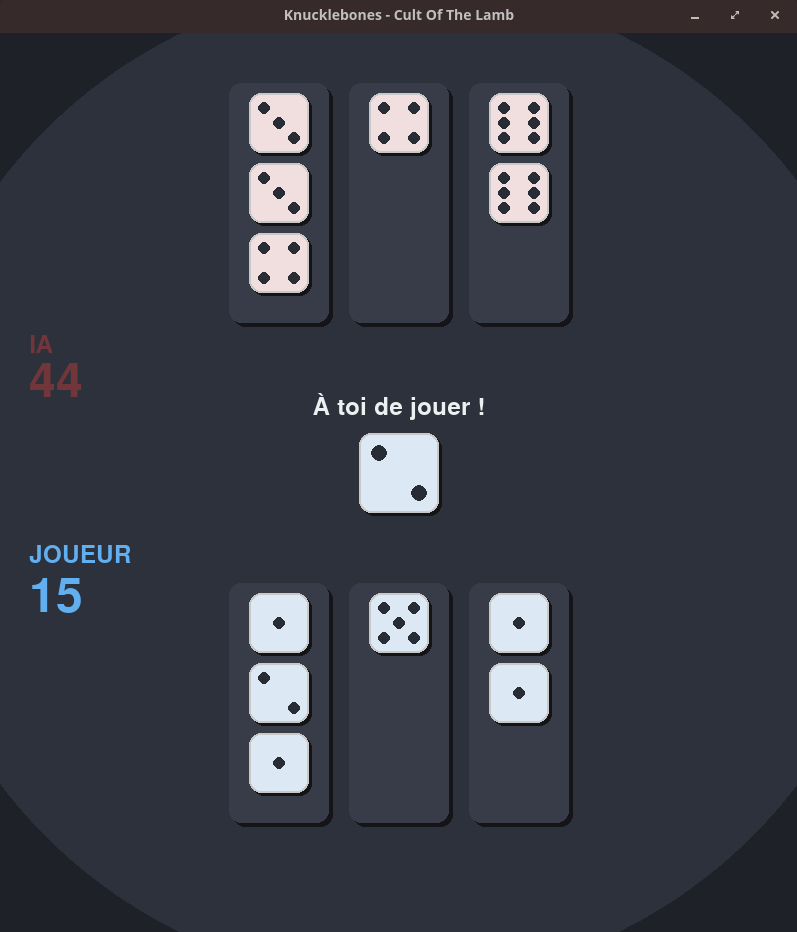

# Knucklebones Game

A Python implementation of the Knucklebones game (created by the game Cult of the Lamb) featuring a graphical interface and an AI opponent using the NegaMax algorithm with transposition tables.

## About

Knucklebones is a strategic dice game where two players compete to achieve the highest score by placing dice in columns. Each player has a board with 3 columns and 3 rows. Players take turns rolling a dice and placing it in one of their columns. When identical values are placed in the same column, they are removed from the opposing column and the player scores points according to the number of repetitions of the dice.

This project features:
- **Graphical Interface**: A Pygame-based UI smooth animations
- **AI Opponent**: An opponent using the NegaMax algorithm with alpha-beta pruning and transposition tables for performance
- **Rust Backend**: Core game logic implemented in Rust, exposed to Python via PyO3



## Installation

### Prerequisites

- Python 3.12 or higher
- Rust toolchain (install from [rustup.rs](https://rustup.rs/))
- `uv` package manager (install from [astral.sh/uv](https://astral.sh/uv))

### Setup Steps

1. **Clone the repository**:
   ```bash
   git clone git@github.com:hugo-hamon/Knucklebones.git
   cd knucklebones
   ```

2. **Create a virtual environment**:
   ```bash
   python -m venv venv
   source venv/bin/activate  # On Windows: venv\Scripts\activate
   ```

3. **Install Python dependencies using uv**:
   ```bash
   uv pip install -e .
   ```
   
   Or if you using pip directly:
   ```bash
   pip install -e .
   ```

4. **Compile the Rust extension**:
   ```bash
   ./rust_compile.sh
   ```

5. **Run the game**:
   ```bash
   uv run main.py # Or python main.py
   ```

## Usage

### Playing the Game

- Click on one of your three columns to place the current dice
- The AI will automatically make its move after yours
- The game ends when a board is full
- Click anywhere after the game ends to restart

### Adjusting AI Difficulty

There is no graphical interface for the moment to modify the depth of the AI, to adjust it, you have to modify the AI depth in `main.py`:

```python
game = GameUI(ai_depth=3)  # Increase for harder AI (slower), decrease for easier (faster)
```

## Project Structure

```
knucklebones/
├── main.py                 # Entry point
├── src/
│   ├── gui.py             # Pygame graphical interface
│   ├── negamax.py         # NegaMax AI implementation
│   └── utils.py           # Utility functions (transposition table management)
├── knucklebones_rust/     # Rust backend
│   ├── src/
│   │   └── lib.rs         # Core game logic in Rust
│   └── Cargo.toml
├── rust_compile.sh        # Script to compile Rust extension
└── pyproject.toml         # Python project configuration
```

## Technical Details

- **Game Logic**: Implemented in Rust for performance, using [PyO3](https://github.com/PyO3/pyo3) bindings
- **AI Algorithm**: [NegaMax](https://en.wikipedia.org/wiki/Negamax) with alpha-beta pruning and transposition tables
- **Transposition Tables**: Automatically saved to `tt.pkl` for caching game states across sessions

## Things to Do

- [ ] Add difficulty levels with different AI depths
- [ ] Implement multiplayer mode (human vs human, AI vs AI ...)
- [ ] Add sound effects, music ...
- [ ] Add statistics tracking (win/loss ratio, best score, etc.)
- [ ] Implement undo/redo functionality
- [ ] Optimize transposition table storage (currently using pickle)
- [ ] Optimize states for the transposition table (6 6 4 == 6 4 6)
- [ ] Add unit tests for game logic
- [ ] Improve AI heuristic evaluation function
- [ ] Add support for different board sizes
- [ ] Replay system
- [ ] Keyboard shortcuts
- [ ] Implement better AI using deep reinforcement learning (Alpha-Zero ...)

## License

This project is licensed under the MIT License - see the [LICENSE](LICENSE) file for details.

## Contributing

Contributions are welcome! Please feel free to submit a Pull Request.

